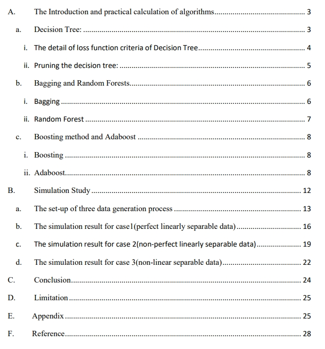

# The-analysis-and-comparison-of-the-tree-based-method-with-different-simulation-assumption
The replication and expansion of the paper Utami, I. T. , Sartono, B. , &amp; Sadik, K. (2014). Comparison of Single and Ensemble  Classifiers of Support Vector Machine and Classification Tree. Journal of Mathematical  Sciences and Applications, 2(2), 17-20.

In the first part of this project, `Decision Tree`, `Bagging Method`, `Random Forest`, `Boosting Method` and `Adaboost` would be introduce, including their math properties and derivation. The clear example of calculation process would also be included as well.

In the second part of this project, three data-generating process would follow the paper mentioned above to test the performance of these algorithms.

The full version please check [The-analysis-and-comparison-of-the-tree-based-method-with-different-simulation-assumption.pdf](https://github.com/YH-Chen1225/The-analysis-and-comparison-of-the-tree-based-method-with-different-simulation-assumption/files/10104421/The-analysis-and-comparison-of-the-tree-based-method-with-different-simulation-assumption.pdf)
